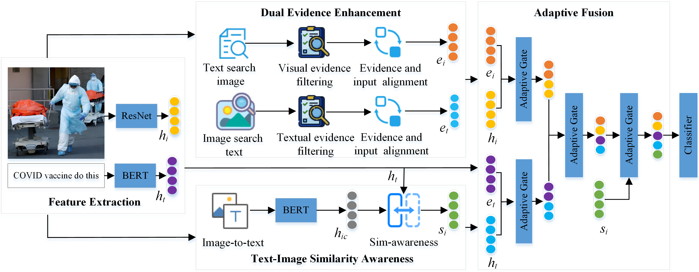
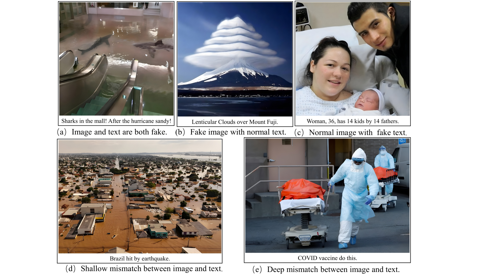

# The framework of the proposed model:

## Datasets
We have preprocessed the original data. For the complete dataset, please download it from Google Drive  <a href="https://drive.google.com/file/d/14NNqLKSW1FzLGuGkqwlzyIPXnKDzEFX4/view?usp=sharing" target='_blank'>link</a>  or Baidu Cloud  <a href="https://pan.baidu.com/s/1OV_Oab0zQgI8P2Wo1qwBuw?pwd=1odv" target='_blank'>link</a>.

### Typical forms of multimodal rumors

## Dependencies
* wordcloud==1.8.1
* torch==1.12.1
* torchvision==0.13.1
* tqdm==4.63.1
* Pillow==8.4.0
* torchmetrics==1.4.0.post0
* pandas==1.1.5
* seaborn==0.11.2
* transformers==4.41.2
* numpy==1.26.4
* jieba==0.42.1
* matplotlib==3.3.4

## Run
python main.py --dataset twitter --model DEETSA

## Acknowledgements
Thank you to **Xuming Hu** (Tsinghua University, Beijing, China), **Zhijiang Guo** (University of Cambridge, Cambridge, United Kingdom), **Junzhe Chen** (Tsinghua University, Beijing, China), **Lijie Wen** (Tsinghua University, Beijing, China), and **Philip S Yu** (University of Illinois at Chicago, Chicago, IL, USA) for providing the dataset.

