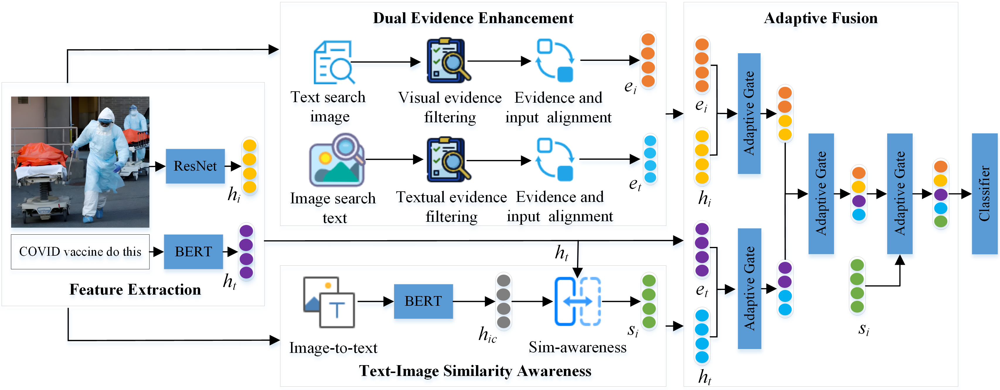
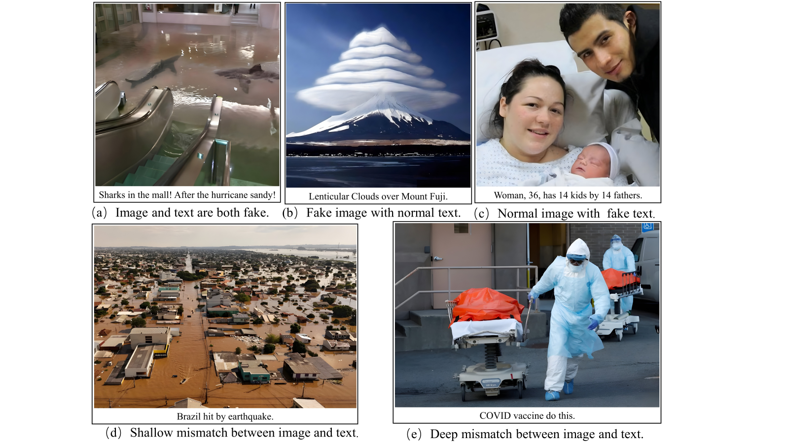

## Dual evidence enhancement and text–image similarity awareness for multimodal rumor detection
we propose a novel multimodal rumor detection framework leveraging dual evidence enhancement and text–image similarity awareness. Specifically, our framework comprises three core components: (1) A text–image similarity awareness module, which quantifies the semantic alignment between textual and visual content to identify potential inconsistencies; (2) A dual evidence enhancement module, which retrieves and filters relevant textual and visual evidence from external knowledge bases and aligns this evidence with the original post through cross-attention, substantially enhancing the model’s capability to detect deep-mismatched rumors; (3) A hierarchical feature fusion mechanism based on a gated neural network, which adaptively integrates features from different modalities by accounting for their varying roles and noise levels at different stages.

## The framework of the proposed model:
<div align="center">

</div>

## Datasets
We have preprocessed the original data. For the complete dataset, please download it from Google Drive  <a href="https://drive.google.com/file/d/14NNqLKSW1FzLGuGkqwlzyIPXnKDzEFX4/view?usp=sharing" target='_blank'>link</a>  or Baidu Cloud  <a href="https://pan.baidu.com/s/1OV_Oab0zQgI8P2Wo1qwBuw?pwd=1odv" target='_blank'>link</a>.

### Typical forms of multimodal rumors
<div align="center">

</div>

## Dependencies
* wordcloud==1.8.1
* torch==1.12.1
* torchvision==0.13.1
* tqdm==4.63.1
* Pillow==8.4.0
* torchmetrics==1.4.0.post0
* pandas==1.1.5
* seaborn==0.11.2
* transformers==4.41.2
* numpy==1.26.4
* jieba==0.42.1
* matplotlib==3.3.4

## Run
python main.py --dataset twitter --model DEETSA


## Citation
If you find this project helps your research, please kindly consider citing our project or papers in your publications.
```
@article{HUANG2025110845,
title = {Dual evidence enhancement and text–image similarity awareness for multimodal rumor detection},
journal = {Engineering Applications of Artificial Intelligence},
volume = {153},
pages = {110845},
year = {2025},
issn = {0952-1976},
doi = {https://doi.org/10.1016/j.engappai.2025.110845},
url = {https://www.sciencedirect.com/science/article/pii/S0952197625008450},
author = {Xuejian Huang and Tinghuai Ma and Huan Rong and Li Jia and Yuming Su},
keywords = {Multimodal rumor detection, Text–image similarity awareness, Dual evidence enhancement, Semantic inconsistency, Cross-attention}
}
```

## Acknowledgements
Thank you to **Xuming Hu** (Tsinghua University, Beijing, China), **Zhijiang Guo** (University of Cambridge, Cambridge, United Kingdom), **Junzhe Chen** (Tsinghua University, Beijing, China), **Lijie Wen** (Tsinghua University, Beijing, China), and **Philip S Yu** (University of Illinois at Chicago, Chicago, IL, USA) for providing the dataset.

